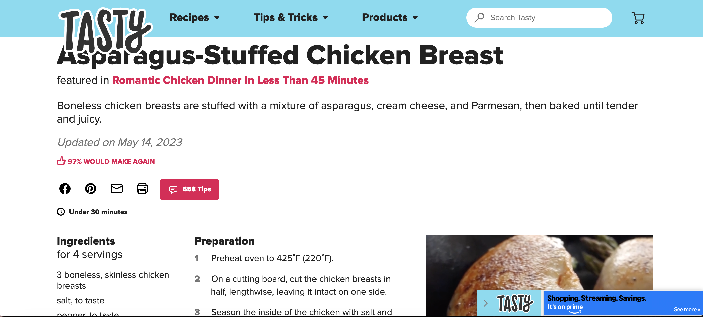

## Exercise 2.5: Django MVT Revisited

### Learning Goals

- Add images to the model and display them on the frontend of your application.
- Create complex views with access to the model.
- Display records with views and templates.

### Reflection Questions

1. In your own words, explain Django static files and how Django handles them.

   - Django static files are typically added by the developer during creation and don’t change dynamically in the application. Django will use the first static file it finds with the matching name.

2. Look up the following two Django packages on Django’s official documentation and/or other trusted sources. Write a brief description of each.

   - ListView : ListView refers to a view to list all or particular instances of a table from the database in a particular order. It is used to display multiple types of data on a single page or view.
   - DetailView : Detail View refers to a view to display a particular instance of a table from the database with all the necessary details. It is used to display multiple types of data on a single page or view.

3. You’re now more than halfway through Achievement 2! Take a moment to reflect on your learning in the course so far. How is it going? What’s something you’re proud of so far? Is there something you’re struggling with? What do you need more practice with?

   - So far I am still enjoying learning more about what I can do with Django. I took some time off to travel and was able to get back into it with ease. I feel confident with %static% and would like to use it more in this project and future projects.

## Frontend Inspirations

### Tasty Recipe Page

I chose the page Tasty uses for its individual recipes for inspiration because I like how it is set up. The Recipe Name up top and in the boldest/largest font and going from left to right with the ingredients and directions.

### AllRecipes Page

I chose the page allrecipes uses to show multiple recipes because of how it blocks off 3 recipes per row and I like how it doesn't look too crowded.

